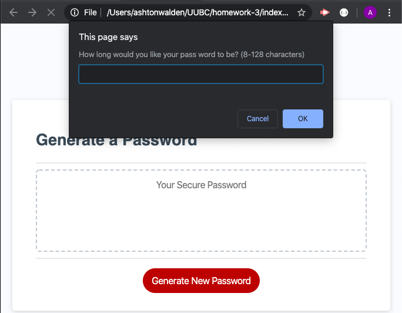
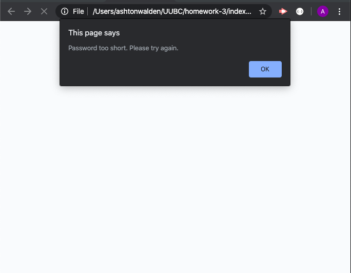
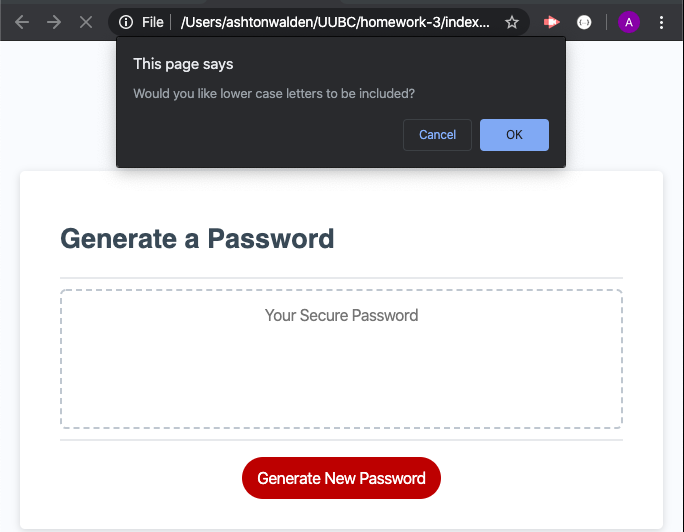
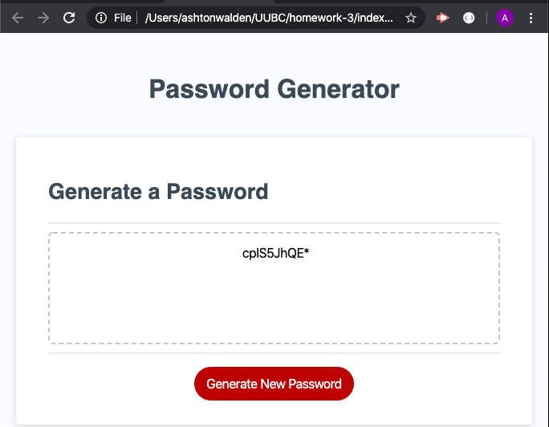

U of U coding bootcamp - Homework 4 - Password Generator

How to use
 - The application will first prompt the user to enter their desired password length. 

;

- If the user enters a number either smaller than 8 or larger than 128 they will be presented with an error message asking them to try again.

;

- Once the user selects an acceptable password length they will then be asked to confirm if they would like the password to contain lowercase letters, uppercase letters, numbers, and special characters.

;

- After the user has finished making their selections the application will display a password that meets the user's specifications.

;

- If the user is not pleased with the password presented they have the option the select the 'Generate New Password' button and they will be presented with a new password that meets their specifications. 